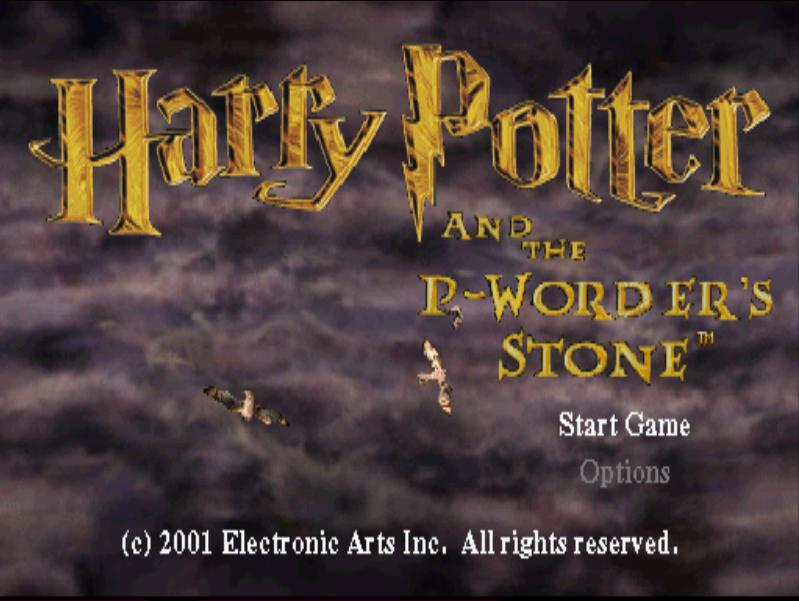

# Harry Potter Tools

Tools for the Harry Potter games on the PS1 / PSX

[](https://travis-ci.com/joshbarrass/hptools)
[](https://codeclimate.com/github/joshbarrass/hptools)
[](https://codeclimate.com/github/joshbarrass/hptools/coverage)
[](https://codeclimate.com/github/joshbarrass/hptools)

## Introduction

This repo is a collection of tools that I've produced for the purpose
of extracting and modifying the Harry Potter PS1 games. Currently
supported is:

 * Extracting .DAT/.DIR files (requires [quickbms](https://aluigi.altervista.org/quickbms.htm))
 * Repacking .DAT/.DIR files (requires [quickbms](https://aluigi.altervista.org/quickbms.htm))
 * Converting .IMG files to most popular image formats
 * Converting most popular image formats to .IMG files
 
These tools make it possible to modify the games. As a proof of
concept, I replaced the text "Harry Potter and the Philosopher's
Stone" on the title screen with "Harry Potter and the P-Worder's
Stone" by modifying some of the .IMG files.



## DAT/DIR Files

The files in the game are stored inside an archive consisting of a
.DAT and .DIR pair (in the case of Harry Potter and the Philosopher's
Stone, these are POTTER.DAT and POTTER.DIR). The .DIR file contains
the file listing for the .DAT file. The structure of the .DIR file is
as follows:

| Offset | Length   | Description                                                                                                           |
|:------:|----------|:---------------------------------------------------------------------------------------------------------------------:|
| 0x0    | 4 bytes  | Number of files in the archive                                                                                        |
| 0x4    | 20 bytes | First file entry                                                                                                      |
| +0x0   | 12 bytes | Filename. If the filename is shorter than 12 bytes, null characters are appended to the end to make it 12 bytes long. |
| +0xC   | 4 bytes  | File size in bytes.                                                                                                   |
| +0x10  | 4 bytes  | File offset                                                                                                           |

The offset points to a location in the .DAT file where the file
begins. Both files are little endian.

The included BMS script can extract all files in the archive:

```
quickbms hp_datdir.bms POTTER.DIR [output folder]
```

This script is also capable of repacking the archive. To do this, you
should modify the files you have extracted and delete any files you
haven't modified. Your modified files **must be the same size or
smaller than the originals!** Then run the command:

```
quickbms -w -r hp_datdir.bms POTTER.DIR [output folder]
```

(here [output folder] refers to the folder your modified files reside
in -- changes will be made directly to the DAT file)

You should make a backup of your .DAT/.DIR files before doing
this. Reinserting the modified files into a disc image without
breaking the structure of the disc image and making the game
unbootable is tricky. You can attempt this manually with a hex editor
if you are confident, but I'd recommend using CDmage (I think this is
Windows-only software, but it works well for me under Wine).

## IMG Files

.IMG files are some of the images used by the game. There are
generally two types of IMG file, though they use the same extension
and, as far as I can see, there is no real way to tell the two
apart. I've covered these two types separately below.

### Direct Colour

This generally refers to IMG files that are fullscreen, such as
loading screen images or the game over screen. In this format, each
pixel is stored as 2 bytes using 15-bit colour, with 5 bits per colour
channel and one unused bit that is always 0. Pixels are arranged left
to right, top to bottom. There is no metadata in the file indicating
its dimensions -- you will have to work this out yourself in a lot of
cases (though for many common types I have identified their dimensions
and stored them in img.py). To work this out, identify the number of
pixels in the image (file size in bytes / 2) and find the factor pairs
(Wolfram Alpha will be helpful for this; you can use a query such as
"factors of 131072" to find the factor pairs). Then, simply use trial
and error until you get an image that looks right.

IMG files are converted into PIL Images, which you can then view
directly or save as any other image format you want. To convert a
direct colour IMG file, you have two options. If it is a common IMG
type (such as a LOADxx.IMG file), it will likely have a dedicated
function for converting it, which won't require you to manually
identify the dimensions. It will also verify the file size to ensure
that you're converting the type of image you claim. In this case, you
would do something like:

```
im = convert_LOAD("/path/to/LOADxx.IMG")
im.save("output.png")
```

If no such function exists for the image you are converting, you will
have to do it manually. You will need to identify the dimensions of
your image (these are typically 4:3 ratio) and do:

```
data = read_IMG("/path/to/IMGfile.IMG")
im = convert_IMG(data, (width, height))
im.show()
```

to check that the dimensions you used are correct. Once your
dimensions are correct, you can use `im.save` to save the image.

If the colours seem completely wrong but regions that should be the
same colour do appear the same colour, it's likely you're dealing with
the second type of IMG file.

### Indexed Colour/Palette Images

The majority of IMG files are of this type. In this format, the first
512 bytes are 15-bit colours again, as in the previous format. This
gives a 256 colour palette. After these first 512 bytes, each pixel
becomes an unsigned 8-bit value (0-255). This value refers to the
index of the corresponding colour in the palette. Generally, colour 0
in the palette is black -- this is used in many of the images for
transparency. Again, there is no metadata in the file, so you will
have to work dimensions out yourself unless I have already identified
them. 

In the case where I have identified the dimensions, such as for the
story images (STORYxxx.IMG), you can use the dedicated function as
normal:

```
im = convert_STORY("/path/to/STORYxxx.IMG")
im.save("output.png")
```

If no such function exists, you will again have to find the dimensions
manually. You will need to identify the number of pixels (file size in
bytes - 512) and find the factor pairs again. You can then use the
following:

```
data = read_IMG("/path/to/IMGfile.IMG")
im = convert_palette_IMG(data, (width, height))
im.show()
```

to verify your dimensions before saving the image.

---------

Once you have converted the image to a format of your choice, you can
modify it and convert it back into a .IMG file. You will need to
remember whether the original IMG file was direct colour or indexed
colour, and you will need to ensure that the dimensions are the same
-- my code will not verify for you that the dimensions/file size are
correct. 

Converting back to .IMG is very simple. For direct colour images, use
the `convert_to_IMG` function:

```
im = Image.open("/path/to/modified.png")
convert_to_IMG(im, "/path/to/IMG.IMG")
```

or for paletted images, use the `convert_to_palette_IMG` function:

```
im = Image.open("/path/to/modified.png")
convert_to_palette_IMG(im, "/path/to/IMG.IMG")
```

You can then reinsert these modified files into your archive using the
steps detailed above.
